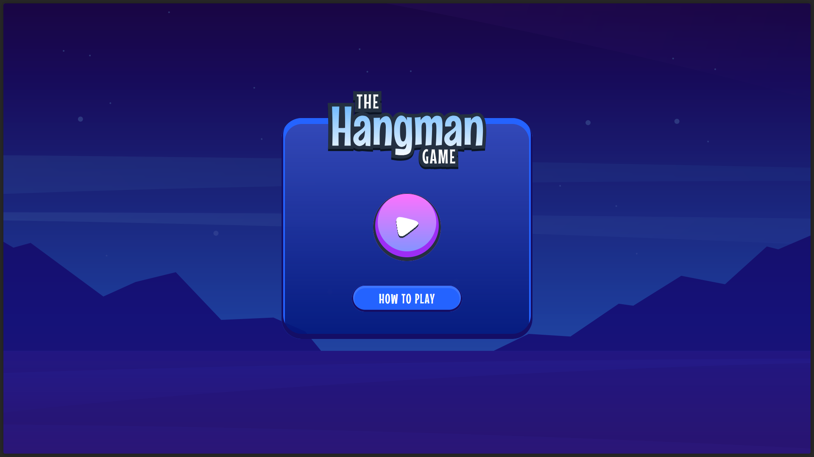
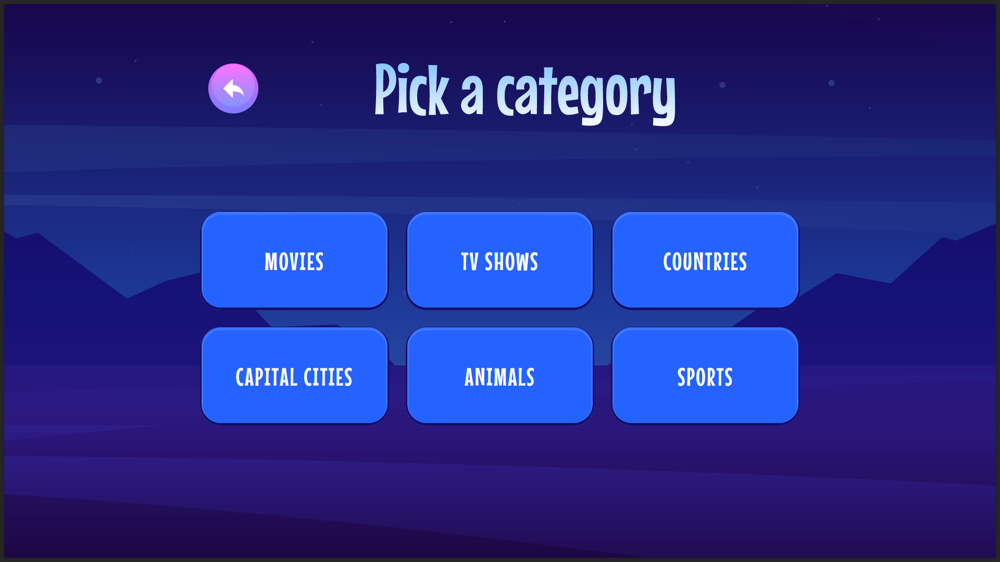
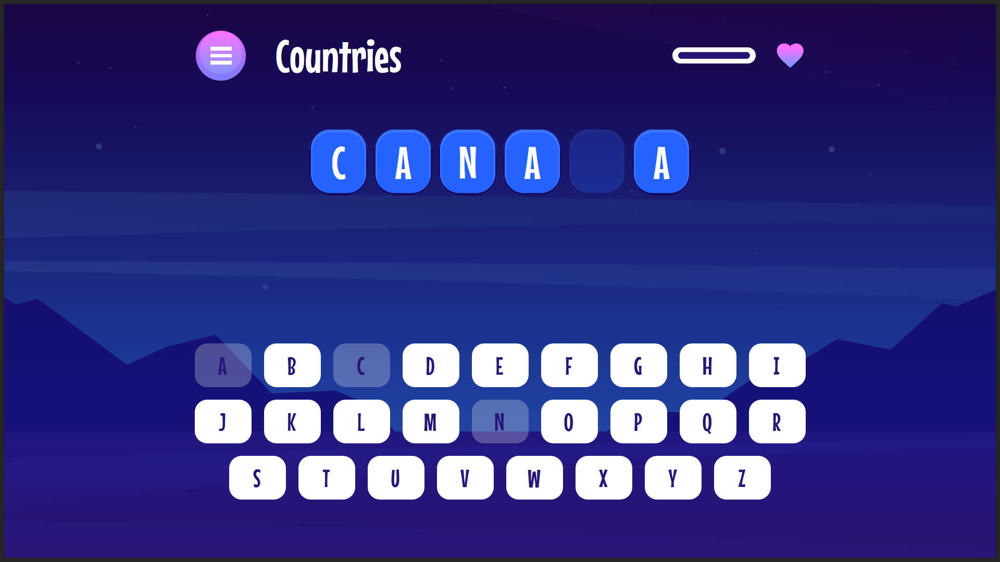
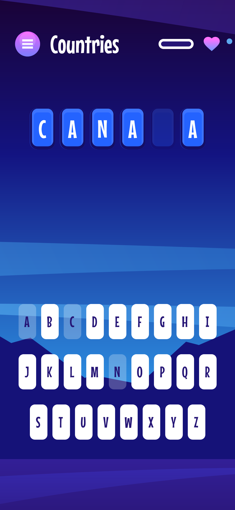

# Hangman Game - Interactive Word Guessing Game

A modern, responsive hangman game featuring multiple categories, visual health tracking, and smooth animations. This project showcases advanced React patterns, comprehensive testing strategies, and accessible design principles.

## 🌟 Project Overview

An engaging word-guessing game where players reveal hidden words by guessing letters across six different categories: Movies, TV Shows, Countries, Capital Cities, Animals, and Sports. The game features an intuitive health system that visually tracks remaining attempts through a dynamic color-coded progress bar.

Building this project deepened my understanding of component architecture and state management patterns, particularly around lifting state effectively and managing complex game logic. I gained valuable experience implementing comprehensive testing strategies, from unit tests for individual components to integration tests for user interactions. The project also reinforced best practices in accessibility, responsive design, and performance optimization.

The challenge of creating smooth, intuitive user interactions while maintaining clean, maintainable code helped me develop a stronger appreciation for thoughtful component composition and proper separation of concerns.

## 🎯 Key Features

### 🎲 Game Mechanics

- **Multiple Categories**: 6 different word categories with 30+ words each
- **Visual Health System**: Dynamic health bar with color-coded feedback (green → yellow → red)
- **Smart Keyboard**: Interactive on-screen keyboard with disabled state management
- **Game States**: Win/lose/pause states with appropriate UI feedback
- **Progress Tracking**: Real-time letter revelation and guess tracking

### 🎨 User Experience

- **Responsive Design**: Seamless experience across desktop, tablet, and mobile
- **Smooth Animations**: CSS transitions and hover effects for better interaction
- **Accessible Interface**: ARIA labels, screen reader support, and tab navigation
- **Visual Feedback**: Immediate response to user actions with state changes
- **Loading States**: Proper loading and error handling

### 🏗️ Technical Architecture

- **Server-Side Rendering**: Optimal performance with App Router
- **Component Composition**: Reusable components with proper prop interfaces
- **State Management**: React hooks with proper state lifting patterns
- **Type Safety**: Full TypeScript coverage with custom type definitions
- **Testing Coverage**: Unit tests for all components and game logic

## 📸 Screenshots

<details>
<summary><code>Desktop Experience</code></summary>

_Homepage with gradient background and card-based layout_


_Category selection with responsive grid layout_


_Game interface with health bar and interactive keyboard_


</details>

<details>
<summary><code>Mobile Experience</code></summary>

_Responsive design adapting to mobile viewports_


</details>

## 🚀 Technical Highlights

### Advanced React Patterns

```typescript
// Server/Client component separation
const GamePlayPage = async ({ searchParams }: PageProps) => {
  const targetWord = pickRandomWordFromCategory(selectedWordCategory);
  return <GamePlayClient category={selectedWordCategory} targetWord={targetWord} />;
};

// Proper state management with hooks
const [gameState, setGameState] = useState<GameState>("playing");
const [guessedLetters, setGuessedLetters] = useState<string[]>([]);
```

### Component Architecture

```typescript
// Reusable components with proper TypeScript interfaces
interface KeyboardProps {
  guessedLetters: string[];
  onUserGuess: (e: React.MouseEvent<HTMLButtonElement>, letter: string) => void;
}

// Proper separation of concerns
const Keyboard = ({ guessedLetters, onUserGuess }: KeyboardProps) => {
  // Component logic
};
```

### Testing Strategy

```typescript
// Comprehensive test coverage
describe("Keyboard Component", () => {
  it("renders all 26 alphabet buttons", () => {
    render(<Keyboard guessedLetters={[]} onUserGuess={mockFn} />);
    expect(screen.getAllByRole("button")).toHaveLength(26);
  });
});
```

## 🛠️ Tech Stack

### Core Technologies

- **Next.js 15** - React framework with App Router
- **TypeScript** - Type-safe JavaScript
- **Tailwind CSS** - Utility-first CSS framework
- **React 19** - Latest React features and hooks

### Development Tools

- **Vitest** - Fast unit testing framework
- **React Testing Library** - Component testing utilities
- **ESLint** - Code linting and formatting
- **Prettier** - Code formatting

### Build & Deployment

- **Next.js Build** - Optimized production builds
- **Vercel** - Deployment platform
- **TypeScript Compiler** - Type checking

## 📊 Project Metrics

<details>
<summary><code>Performance Metrics - Verified Results</code></summary>

### 🚀 Core Web Vitals - All Green!

**Measured with [web.dev/measure](https://web.dev/measure):**

- **First Contentful Paint**: 0.2s ⚡ (Excellent)
- **Largest Contentful Paint**: 0.3s ⚡ (Excellent)
- **Cumulative Layout Shift**: 0.001 ✅ (Excellent)
- **Total Blocking Time**: 10ms ⚡ (Excellent)
- **Speed Index**: 0.5s ⚡ (Excellent)

**Verified with [WebPageTest.org](https://webpagetest.org):**

- **Time to First Byte**: 195ms ⚡
- **Start Render**: 400ms ⚡
- **First Contentful Paint**: 458ms ⚡
- **Speed Index**: 517ms ⚡
- **Largest Contentful Paint**: 458ms ⚡
- **Cumulative Layout Shift**: 0 ✅ (Perfect)
- **Total Blocking Time**: 0ms ⚡ (Perfect)
- **Page Weight**: 146KB 🪶 (Lightweight)

**Interactive Performance:**

- **Time to Interactive**: ~305ms ⚡ (Lightning fast)

</details>

<details>
<summary><code>Code Quality & Testing</code></summary>

### 📝 TypeScript Implementation

- ✅ **Full TypeScript Coverage**: All components and utilities typed
- ✅ **Custom Type Definitions**: Game states, component props, and interfaces
- ✅ **Strict Mode**: Enabled for maximum type safety

### 🧪 Testing Strategy

- ✅ **Unit Tests**: Component rendering and interaction testing
- ✅ **Integration Tests**: User workflow testing with React Testing Library
- ✅ **Mock Implementation**: Proper mocking of Next.js components
- 🔄 **Coverage Reports**: In progress - expanding test coverage

### 📦 Build Optimization

- ✅ **Next.js Optimization**: Automatic code splitting and optimization
- ✅ **Bundle Analysis**: Lightweight 146KB total page weight
- ✅ **Production Ready**: Optimized builds with Vercel deployment

</details>

<details>
<summary><code>Accessibility & Browser Support</code></summary>

### ♿ Accessibility Features

- ✅ **Semantic HTML**: Proper heading hierarchy and landmark elements
- ✅ **Tab Navigation**: Full keyboard navigation support
- ✅ **ARIA Labels**: Screen reader friendly button labels
- ✅ **Focus Management**: Logical tab order throughout the interface
- 🔄 **Screen Reader Testing**: Planned for comprehensive accessibility audit
- 🔄 **Color Contrast Validation**: Planned verification with WebAIM tools

### 🌐 Browser Compatibility

- ✅ **Modern Browser Support**: ES6+ features with Next.js compatibility
- ✅ **Responsive Design**: Mobile-first approach with tested breakpoints
- 🔄 **Cross-browser Testing**: Planned testing across multiple browsers

### 📐 Responsive Design

- ✅ **Mobile**: 320px - 768px (Tested on multiple devices)
- ✅ **Tablet**: 768px - 1024px (Responsive grid layouts)
- ✅ **Desktop**: 1024px+ (Optimized for larger screens)

_Note: Physical keyboard navigation (pressing 'A' key to guess 'A') is planned for the next iteration. Current implementation supports tab navigation._

</details>

<details>
<summary><code>Development & Testing Tools</code></summary>

### 🔧 Verified Tools & Processes

- ✅ **Performance Testing**: web.dev/measure and WebPageTest.org
- ✅ **TypeScript Compilation**: Zero errors in production build
- ✅ **Vitest Testing**: Unit and integration test suite
- ✅ **ESLint**: Code quality and consistency checks

### 📋 Planned Testing

- 🔄 **Accessibility Audit**: axe DevTools and manual testing
- 🔄 **Cross-browser Testing**: Chrome, Firefox, Safari, Edge
- 🔄 **Screen Reader Testing**: NVDA, JAWS, VoiceOver
- 🔄 **Performance Monitoring**: Lighthouse CI integration

</details>

## 🎮 How to Play

1. **Choose Category**: Select from Movies, TV Shows, Countries, Animals, etc.
2. **Guess Letters**: Click on-screen keyboard or use tab navigation
3. **Watch Health**: Monitor your remaining guesses with the visual health bar
4. **Win or Lose**: Complete the word before health runs out!

## 🏃‍♂️ Quick Start

```bash
# Clone the repository
git clone https://github.com/Md-Talim/hangman-game.git

# Install dependencies
npm install

# Run development server
npm run dev

# Run tests
npm run test

# Build for production
npm run build
```

## 🧪 Testing

The project includes comprehensive testing coverage:

```bash
# Run all tests
npm run test
```

## 🎯 Learning Outcomes

### Frontend Development

- **Modern React**: Hooks, context, and latest patterns
- **TypeScript**: Advanced types, interfaces, and generics
- **Component Architecture**: Reusable, testable components
- **State Management**: Proper lifting and prop drilling

### Testing & Quality

- **Unit Testing**: Component and logic testing
- **Integration Testing**: User interaction testing
- **Accessibility Testing**: Screen reader and keyboard testing
- **Performance Testing**: Core Web Vitals optimization

### User Experience

- **Responsive Design**: Mobile-first approach
- **Accessibility**: WCAG compliance
- **Performance**: Optimized loading and rendering
- **Animation**: Smooth transitions and feedback

## 🔗 Links

- **Live Demo**: [hngmn.vercel.app](https://hngmn.vercel.app/)
- **Frontend Mentor Challenge**: [Hangman Game Challenge](https://www.frontendmentor.io/challenges/hangman-game-rsQiSVLGWn)

---

**Built with ❤️ by Md Talim** - _Demonstrating modern frontend development practices_
